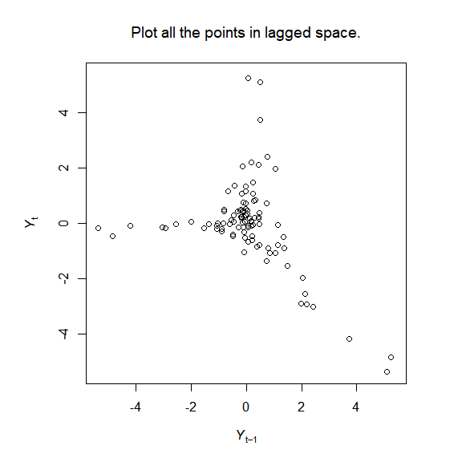

<!-- README.Rmd no longer generated from README.Rmd. Can edit here. -->

# pbsEDM

<!-- badges: start -->

[](https://github.com/pbs-assess/pbsEDM/actions)
[](https://app.codecov.io/gh/pbs-assess/pbsEDM?branch=main)

<!-- [](https://www.repostatus.org/#wip) -->

<!-- badges: end -->

An R package to implement some of the methods of empirical dynamic modelling

The name `pbsEDM` combines our workplace, the Pacific Biological Station (PBS) in British Columbia, Canada, with empirical dynamic modelling (EDM), the focus of the package. The package was developed in conjuction with a manuscript currently being submitted. 

The package implements the simplex and S-map algorithms of empirical dynamic modelling, and creates visualisations to help understand the methods, for example:



Users can also analyse their own data. The package should not really be used yet until the associated manuscript is reviewed (and the package will be more understandable in conjunction with the manuscript). However, it can be installed directly from GitHub with

```
install.packages("devtools")     # One-time installation if you don't already have devtools
devtools::install_github("pbs-assess/pbsEDM")
```

## Vignettes

The vignettes are already rendered here:

* [analyse_simple_time_series.html](http://htmlpreview.github.io/?https://github.com/pbs-assess/pbsEDM/blob/master/vignettes/analyse_simple_time_series.html) How to analyse a simple time series using the simplex algorithm, and produce figures that help understand the algorithm.
* [aspect_2.html](http://htmlpreview.github.io/?https://github.com/pbs-assess/pbsEDM/blob/master/vignettes/aspect_2.html) Demonstration of Aspect 2.
* [aspect_3_4.html](http://htmlpreview.github.io/?https://github.com/pbs-assess/pbsEDM/blob/master/vignettes/aspect_3_4.html) Demonstrations of Aspects 3 and 4.
* [pbsSmap.html](http://htmlpreview.github.io/?https://github.com/pbs-assess/pbsEDM/blob/master/vignettes/pbsSmap.html) Demonstration of S-map code.

The source code written in `Rmarkdown`, the R code that gets extracted from the
  `Rmarkdown` code, and the resulting .html files are all found within your library
  folder (where all your R libraries get saved), in
  `library\pbsEDM\doc\`. Or you can look at the `vignettes\` folder on GitHub or locally.

## To reproduce and save the figures for the manuscript

Just run the following code. Type the function name (or look at the help with ?<function_name>) to see what it does.
```
E_results <- pbsEDM_Evec(NY_lags_example$N_t)

plot_pbsEDM_Evec_save(E_results)      # Figure 1

plot_explain_edm_save(E_results[[1]]) # Figure 2

plot_rho_Evec_save()                  # Figure 3

plot_library_size_save()              # Figure 4 

# Animated figures for the Appendix:

plot_pbsEDM_Evec_movie_save(E_results)                # Figure S.1

plot_explain_edm_movie_save(E_results[[1]])           # Figure S.2 

plot_explain_edm_all_tstar_movie_save(E_results[[1]]) # Figure S.3
```

